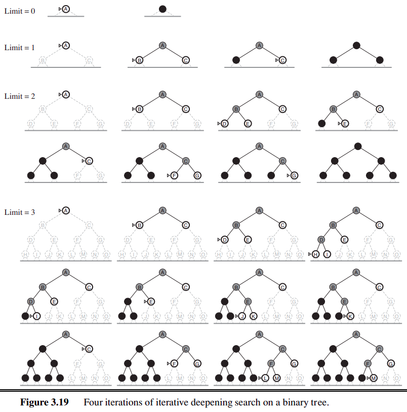

## Introduction

Iterative Deepening Depth-First Search (IDDFS) is an uninformed search algorithm used for traversing or searching a graph. IDDFS explores the search space iteratively, incrementally increasing the depth limit with each iteration. It combines the benefits of memory requirements of depth-first search with the completeness and optimality of breadth-first search, making it suitable for searching large graphs with unknown depths.

## Algorithm

The IDDFS algorithm is a depth-limited search strategy that iteratively explores the search space, gradually increasing the depth limit until the goal node is found. It uses depth-first search (DFS) to explore nodes within each depth limit.

STEP 1: Initialize the depth limit to 0.

STEP 2: Perform depth-limited depth-first search (DLDFS) with the current depth limit starting from the start node. (In depth-limited DFS, DFS is only performed upto a certain depth limit, beyond which nodes are not considered.)

STEP 3: If the goal node is found during DLDFS, return the path to the goal node.

STEP 4: If the goal node is not found and there are still nodes to explore, increment the depth limit and repeat steps 2 and 3.

STEP 5: If the goal node is not found and the depth limit exceeds a predefined maximum depth or the maximum depth of the tree, terminate the search.

## Example
Reference: Section 3.4.5 of Reference 1

## Optimality and Completeness
**Optimality:**
Like Breadth-First Search, IDDFS is optimal if the path cost is a non-decreasing function of the depth of the node. This is because IDDFS does not take into account the step costs. Since the path cost is non-decreasing with depth, the algorithm will encounter the optimal solution (if it exists) at a shallower depth before exploring deeper levels. 

**Completeness:**
IDDFS is complete for finite graphs. It exhaustively searches the entire search space, incrementally increasing the depth limit with each iteration until the goal node is found or until the maximum depth limit is reached. As long as the branching factor is finite and the depth limit is sufficient, IDDFS will find a solution if one exists.

## Space and Time Complexity
The space complexity of IDDFS is the same as DFS - $O(bm)$, where b is the branching factor and m is maximum depth limit. IDDFS may seem like it will have a high time complexity as states are generated multiple times. However, this is not the case. This is because the nodes at the bottom level (depth d) are generated once, those on the next to bottom level are generated twice, and so on, up to the children of the root which are generated d times. So the total number of nodes generated in the worst case is:

$N(IDDFS) = (d)b + (d-1)b^2 + ... + (1)b^d$,

which gives a time complexity of $O(b^d)$ - asymptotically the same as Breadth-First Search. There is some extra cost for generating the upper levels multiple times, but it is not large.

Reference: Section 3.4.5 of Reference 1
## Advantages
**Memory Efficiency:** IDDFS requires less memory compared to breadth-first search, as it explores nodes in a depth-first manner and discards unnecessary nodes as it increases the depth limit.

**Large Search Spaces**: In general, IDDFS is the preferred uninformed search method when the search space is large and the depth of the solution is not known. It performs better than DFS which might unnecessarily explore a large subtree before reaching the goal node.

## Disadvantages
**Time Complexity:** IDDFS may have high time complexity, especially for large graphs or when the optimal solution is deep in the search tree. It may repeat work at each depth level, leading to inefficiency.

**Completeness:** IDDFS is not complete for infinited graphs. It may not be suitable for graphs with unknown depths, as it required specifying a maximum depth limit.

**Optimality:** IDDFS does not necessarily find the shortest path or the most optimal solution. It is only optimal if the step costs are a non decreasing function of the depth of the node.